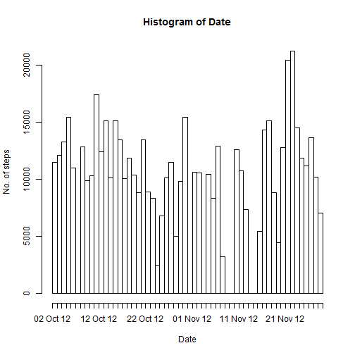
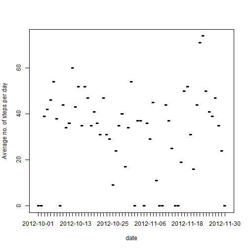
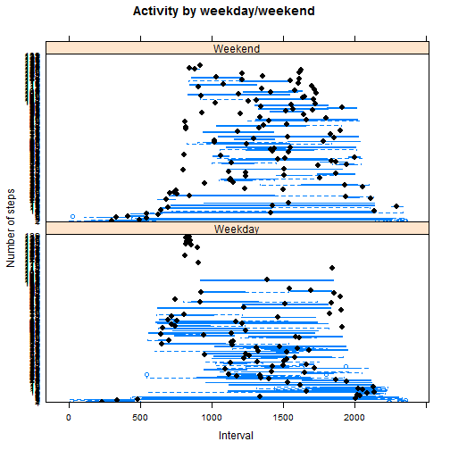

1. Loading and pre-processing the data
======================================


```r
fileName <- paste(getwd(),"/","repdata-data-activity","/","activity.csv",sep="")

activity <- read.csv(file = fileName, header=T)

str(activity)
```

```
## 'data.frame':	17568 obs. of  3 variables:
##  $ steps   : int  NA NA NA NA NA NA NA NA NA NA ...
##  $ date    : Factor w/ 61 levels "2012-10-01","2012-10-02",..: 1 1 1 1 1 1 1 1 1 1 ...
##  $ interval: int  0 5 10 15 20 25 30 35 40 45 ...
```

```r
ncount <- nrow(activity)
```
The no. of observations is 17568.

2. What is mean total number of steps taken per day?
====================================================


```r
library(sqldf)
```

```
## Warning: package 'sqldf' was built under R version 3.2.3
```

```
## Loading required package: gsubfn
## Loading required package: proto
## Loading required package: RSQLite
## Loading required package: DBI
```

```r
options(scipen=999)
summaryData <- sqldf("SELECT activity.date, SUM(activity.steps) AS TOTAL_STEPS FROM activity GROUP BY activity.date")
```

```
## Loading required package: tcltk
```

```r
summaryData
```

```
##          date TOTAL_STEPS
## 1  2012-10-01        <NA>
## 2  2012-10-02         126
## 3  2012-10-03       11352
## 4  2012-10-04       12116
## 5  2012-10-05       13294
## 6  2012-10-06       15420
## 7  2012-10-07       11015
## 8  2012-10-08        <NA>
## 9  2012-10-09       12811
## 10 2012-10-10        9900
## 11 2012-10-11       10304
## 12 2012-10-12       17382
## 13 2012-10-13       12426
## 14 2012-10-14       15098
## 15 2012-10-15       10139
## 16 2012-10-16       15084
## 17 2012-10-17       13452
## 18 2012-10-18       10056
## 19 2012-10-19       11829
## 20 2012-10-20       10395
## 21 2012-10-21        8821
## 22 2012-10-22       13460
## 23 2012-10-23        8918
## 24 2012-10-24        8355
## 25 2012-10-25        2492
## 26 2012-10-26        6778
## 27 2012-10-27       10119
## 28 2012-10-28       11458
## 29 2012-10-29        5018
## 30 2012-10-30        9819
## 31 2012-10-31       15414
## 32 2012-11-01        <NA>
## 33 2012-11-02       10600
## 34 2012-11-03       10571
## 35 2012-11-04        <NA>
## 36 2012-11-05       10439
## 37 2012-11-06        8334
## 38 2012-11-07       12883
## 39 2012-11-08        3219
## 40 2012-11-09        <NA>
## 41 2012-11-10        <NA>
## 42 2012-11-11       12608
## 43 2012-11-12       10765
## 44 2012-11-13        7336
## 45 2012-11-14        <NA>
## 46 2012-11-15          41
## 47 2012-11-16        5441
## 48 2012-11-17       14339
## 49 2012-11-18       15110
## 50 2012-11-19        8841
## 51 2012-11-20        4472
## 52 2012-11-21       12787
## 53 2012-11-22       20427
## 54 2012-11-23       21194
## 55 2012-11-24       14478
## 56 2012-11-25       11834
## 57 2012-11-26       11162
## 58 2012-11-27       13646
## 59 2012-11-28       10183
## 60 2012-11-29        7047
## 61 2012-11-30        <NA>
```

```r
TOTAL_STEPS <- as.numeric(summaryData$TOTAL_STEPS)
mean <- mean(TOTAL_STEPS, na.rm=TRUE)
median <- median(TOTAL_STEPS,na.rm=TRUE)
```


Drawing a histogram depicting frequency distribution of no. of steps for the entire duration


```r
summaryData$TOTAL_STEPS[is.na(summaryData$TOTAL_STEPS)] = 0
numStepsVsDates <- rep(summaryData$date,summaryData$TOTAL_STEPS)
hist(as.Date(numStepsVsDates),format="%d %b %y",breaks="days",xlab="Date",ylab="No. of steps",freq=TRUE)
```

 

Mean is 10766.1886792 and Median is 10765.

3. What is the average daily activity pattern?
==============================================


```r
avgSummaryData <- sqldf("SELECT activity.date, AVG(activity.steps) AS AVG_STEPS FROM activity GROUP BY activity.date")
avgSummaryData$AVG_STEPS <- as.numeric(avgSummaryData$AVG_STEPS)
avgSummaryData$AVG_STEPS <- round(avgSummaryData$AVG_STEPS,0)
avgSummaryData$AVG_STEPS[is.na(avgSummaryData$AVG_STEPS)] = 0
str(avgSummaryData)
```

```
## 'data.frame':	61 obs. of  2 variables:
##  $ date     : Factor w/ 61 levels "2012-10-01","2012-10-02",..: 1 2 3 4 5 6 7 8 9 10 ...
##  $ AVG_STEPS: num  0 0 39 42 46 54 38 0 44 34 ...
```

```r
head(avgSummaryData,2)
```

```
##         date AVG_STEPS
## 1 2012-10-01         0
## 2 2012-10-02         0
```

```r
plot(avgSummaryData$date,avgSummaryData$AVG_STEPS,type="l",xlab="date",ylab="Average no. of steps per day")
```

 

```r
maxNumStepsDay <- avgSummaryData$date[which.max(avgSummaryData$AVG_STEPS)]
```

Day, which has maximum no. of average steps,  is 2012-11-23.


4. Inputing missing values
===========================


```r
NAMissingCount = sum(is.na(activity$steps))
```

No. of missing values in the dataset is 2304.


```r
#i <- 1
#for(i in 1:nrow(activity)){
 # missingValue <- activity$date[i]
 # activity$steps[is.na(activity$steps)] =     
   # avgSummaryData$AVG_STEPS[avgSummaryData$date==missingValue]
#print(missingValue)
#i <- i+1
#}

activity$steps2 <- activity$steps
ind <- is.na(activity$steps2) #find where missing values are
missingDates <- activity$date[ind] #find to what dates the missing values belong to

activity$steps2[ind] <- avgSummaryData$AVG_STEPS[missingDates] #substitute the missing values with average values of no. of steps for that date
```

Changed the missing values to average no. of steps for that day


```r
hisogramData <- sqldf("SELECT activity.date, SUM(activity.steps2) AS TOTAL_STEPS FROM activity GROUP BY activity.date")

histStepsVsDates <- rep(hisogramData$date,hisogramData$TOTAL_STEPS)
hist(as.Date(histStepsVsDates),format="%d %b %y",breaks="days",xlab="Date",ylab="No. of steps",freq=TRUE)
```

 

```r
TOTAL_STEPS <- as.numeric(hisogramData$TOTAL_STEPS)
mean <- mean(TOTAL_STEPS, na.rm=TRUE)
median <- median(TOTAL_STEPS,na.rm=TRUE)
```

New values for Mean is 9354.2295082 and Median is 10395.
Both mean and median values have reduced after this treatment.


5.Are there differences in activity patterns between weekdays and weekends?
============================================================================


```r
#creating factor (weekend/weekday) variable
activity$days <- weekdays(as.Date(activity$date))

i<- 1
for(i in 1:nrow(activity)){
if(activity$days[i] %in% c("Monday","Tuesday","Wednesday","Thursday","Friday"))
  activity$dayType[i] <- "Weekday"
else activity$dayType[i] <- "Weekend"
i <- i+1
}
activity$dayType <- as.factor(activity$dayType)

avgWeekDayEndSummaryData <- sqldf("SELECT activity.interval, activity.dayType,AVG(activity.steps) AS AVG_STEPS FROM activity GROUP BY  activity.interval, activity.dayType")

avgWeekDayEndSummaryData$AVG_STEPS <- round(avgWeekDayEndSummaryData$AVG_STEPS,0)

#avgWeekDayEndSummaryData

#creating panel plot

library(lattice)

bwplot(avgWeekDayEndSummaryData$AVG_STEPS~avgWeekDayEndSummaryData$interval|avgWeekDayEndSummaryData$dayType,type="l",ylab="Number of steps",xlab="Interval",main="Activity by weekday/weekend",layout=c(1,2))
```

 
